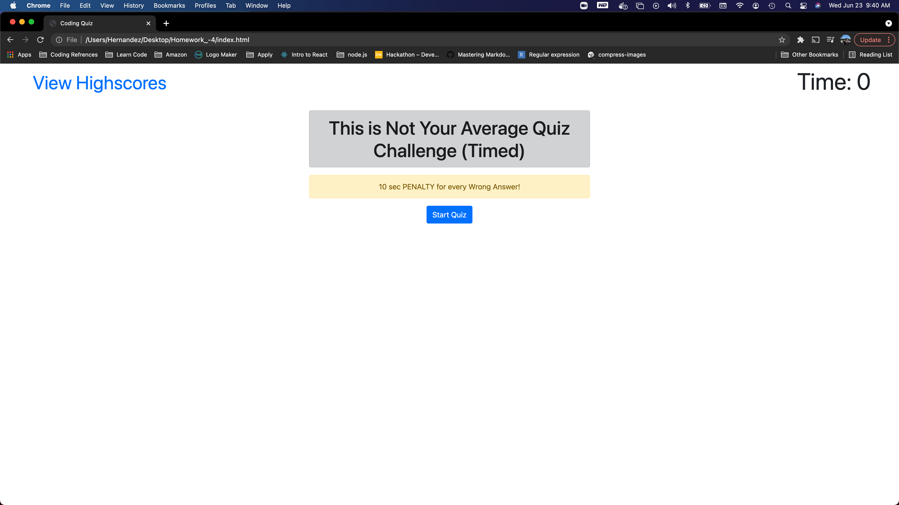

# Not Your Average Quiz

​
## Description
​
Take a challenge quiz using simple HTML, JS, and CSS. I used local storage to store the highscores.

Screenshot:

​
## Table of Contents 
​
* [Installation](#installation)
​
* [Usage](#usage)
​
* [License](#license)
​
* [Contributing](#contributing)
​
* [Tests](#tests)
​
* [Questions](#questions)
​
## Installation

First clone this app on your desktop

Open it using VSCODE

Go to the index.html

Press option and "B" key to open in browser 
​
## Usage
​
Free to use; have fun :)
​
## License
​
This project is licensed under the APACHE 2.0 license.
  
## Contributing
​

​
## Questions
​
If you have any questions about the repo, open an issue or contact me directly at mariohernandezk10@gmail.com. You can find more of my work at [MarioHernandez](https://github.com/mariohernandezk10/note_taker).
